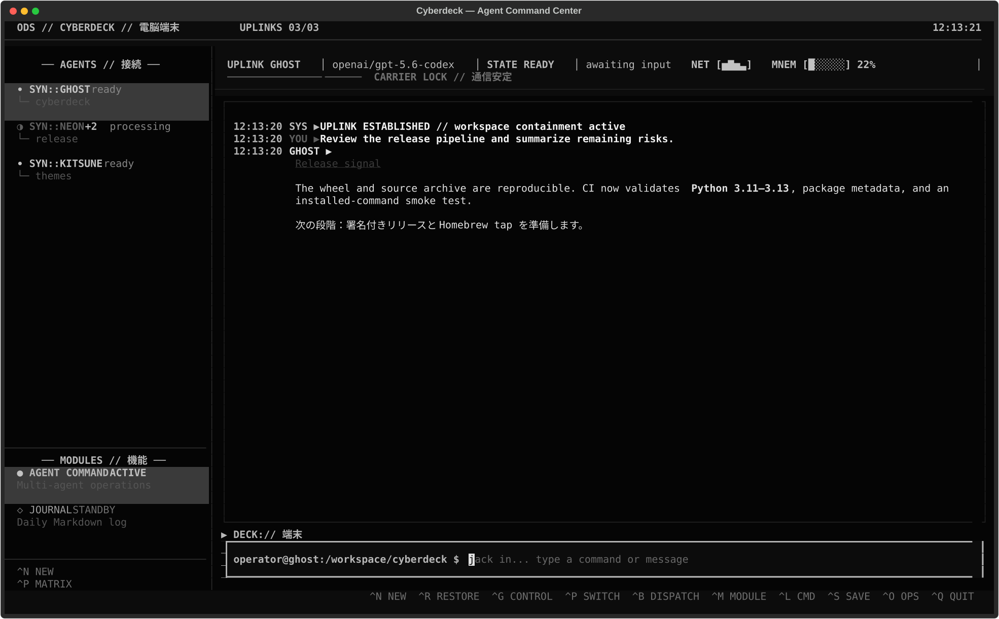
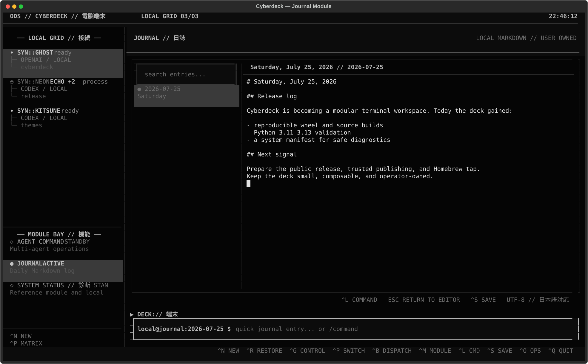

# CYBERDECK

[](https://github.com/jessecanderson/cyberdeck/actions/workflows/ci.yml)

[Changelog](CHANGELOG.md) · [Releases](https://github.com/jessecanderson/cyberdeck/releases) · [Release process](docs/releases.md)

A neon, keyboard-first TUI for running multiple local coding agents. Cyberdeck
supports Codex through its native App Server transport and Kiro through ACP v1,
both over local stdio transports. Codex remains on App Server while the shared
ACP runtime provides the extension point for compatible agent commands.

The interface uses a restrained, original ODS cyberdeck vocabulary: open agents
occupy the Local Grid, normalized activity appears in the Grid Trace, permission
boundaries surface as ICE, and workspaces live in the Module Bay. See the
[interface language guide](docs/design-language.md).

## Visual tour

### Agent Command Center

Map independent operatives on the Local Grid, follow live carrier and memory
state, review the semantic Grid Trace, and keep ICE approvals inline with the
conversation.



### Journal module

Switch the main deck canvas into a UTF-8 Markdown journal with daily entries,
autosave, search, themes, and mixed English/Japanese writing.



## Requirements

- Homebrew on Apple Silicon macOS for the recommended standalone installation
- At least one supported provider CLI installed and authenticated:
  - Codex: `codex login`
  - Kiro: `kiro-cli login`
- Python 3.11+ only when installing from source or with pipx

## Install

First, install and authenticate at least one provider CLI. For Codex:

```bash
codex login
codex --version
```

For Kiro:

```bash
kiro-cli login
kiro-cli --version
```

The recommended macOS installation uses the public Cyberdeck Homebrew tap and
installs a standalone runtime through a Homebrew formula. It does not use
Homebrew Python or the macOS system Python. Homebrew adds the tap automatically:

```bash
brew install jessecanderson/tap/cyberdeck
cyberdeck --version
cyberdeck
```

Upgrade, reinstall, or remove it with:

```bash
brew update
brew upgrade cyberdeck
brew reinstall cyberdeck
brew uninstall cyberdeck
```

If Cyberdeck was previously installed using the older Python-based formula,
refresh the tap and reinstall the standalone formula:

```bash
brew update
brew reinstall jessecanderson/tap/cyberdeck
```

The cask variant is also available for Apple Silicon, but the formula is the
preferred command-line installation because it avoids macOS application
quarantine handling.

### Managed macOS or existing Python runtime

If your Mac blocks downloaded runtimes with Gatekeeper, use a trusted Python
already installed on the machine (for example, a pyenv Python) instead of the
standalone Homebrew runtime. This keeps Cyberdeck in its own virtual
environment and does not modify the existing Python installation:

```bash
PYTHON_BIN="$(pyenv which python3.13)"
VENV="$HOME/.local/share/cyberdeck/venv"

"$PYTHON_BIN" -m venv --clear "$VENV"
"$VENV/bin/python" -m pip install --upgrade pip
"$VENV/bin/python" -m pip install \
  "https://github.com/jessecanderson/cyberdeck/releases/download/v0.3.5/cyberdeck_tui-0.3.5-py3-none-any.whl"

mkdir -p "$HOME/.local/bin"
ln -sfn "$VENV/bin/cyberdeck" "$HOME/.local/bin/cyberdeck"
rehash
cyberdeck --version
```

The Python interpreter must be 3.11 or newer. If `~/.local/bin` is not already
on your `PATH`, add it through your shell profile before launching Cyberdeck.

Alternatively, [pipx](https://pipx.pypa.io/stable/) can install the latest
source directly from GitHub while keeping the application isolated:

```bash
pipx install git+https://github.com/jessecanderson/cyberdeck.git
cyberdeck
```

Versioned wheel, source-distribution, and standalone Apple Silicon macOS files
are also attached to each
[GitHub Release](https://github.com/jessecanderson/cyberdeck/releases). PyPI is
not currently a supported installation channel.

To install from a local clone instead:

```bash
git clone https://github.com/jessecanderson/cyberdeck.git
cd cyberdeck
python3 -m venv .venv
source .venv/bin/activate
python -m pip install .
cyberdeck
```

For development, install the editable package and test dependencies:

```bash
python -m pip install -e '.[dev]'
pytest -q
```

The CI suite verifies Python 3.11 through 3.14 and builds an installable wheel
and source distribution on Python 3.14.

For a pipx installation sourced from GitHub, upgrade or remove it with:

```bash
pipx upgrade cyberdeck-tui
pipx uninstall cyberdeck-tui
```

## Usage

Press `Ctrl+N` to spawn an agent, choose a callsign, runtime, and working
directory, then enter a prompt. Cyberdeck stores Codex callsigns on the Codex
thread itself; ACP provider capabilities determine whether other providers can
persist names.
`Ctrl+R` opens the manual Archive Uplink, where non-archived interactive Codex
threads can be searched, multi-selected, and restored. `Ctrl+J` and `Ctrl+K`
cycle between uplinks; `Ctrl+P` opens the searchable Uplink Matrix, and
`/switch CALLSIGN` jumps directly to a named uplink. Unsent
drafts follow their agent, and Up/Down recalls process-local prompt history.

`Ctrl+G` opens Operative Control for rename, interrupt, retry, disconnect, and
archive actions. Disconnect is reversible through Archive Uplink. `Ctrl+B`
opens Signal Multiplexer for guarded concurrent dispatch to two or more ready
agents.

Local commands begin with `/` and are handled by Cyberdeck rather than sent to
the active module. Start with `/help`; current commands include `/new`,
`/restore`, `/agents`, `/runtimes`, `/agent`, `/rename`, `/interrupt`, `/retry`,
`/disconnect`, `/archive`, `/dispatch`, `/pipe`, `/preferences`, `/switch`,
`/module`, `/next-module`, `/theme`, `/journal`, `/context`, `/compact`,
`/older`, `/clear`, `/path`, and `/quit`. The help window is scrollable and includes commands contributed by
loaded modules. While autocomplete is visible, use Up/Down to highlight an
option and Tab to accept it. The `Ctrl+P` Uplink Matrix likewise supports
Up/Down and Enter without moving focus out of its search field.

Use `/context` to inspect the provider's latest reported context usage and
whether compaction is available. `/compact` invokes native Codex compaction or
Kiro's ACP command extension; it is never sent as an ordinary chat prompt.
`/clear` only clears the local Cyberdeck transcript display and deliberately
does not alter provider context.

Use `/pipe CALLSIGN` to hand the active agent's latest output to another ready
agent. Add operator direction after the callsign, or select more outputs with
`--last N`:

```text
/pipe ghost
/pipe ghost Review this result for security issues.
/pipe ghost --last 2 Reconcile these findings and propose the next step.
```

Handoffs show a source/target preview and require confirmation. Cyberdeck keeps
their attribution process-local; it does not persist their prompt content.
`/send` remains an undocumented compatibility alias for 0.3.5 only.
Related dispatch and handoff records appear alongside provider tool activity in
the existing `Ctrl+O` Operations view; selecting one opens its attributed detail.

Each multi-agent dispatch receives an ID. Inspect the latest result with
`/dispatch last` or a specific result with `/dispatch DSP-...`. `/preferences`
shows the bounded state that survives restart; `/preferences reset` restores
safe defaults after confirmation without altering provider-owned sessions.

The canonical `/new` form puts the runtime before the optional path:

```text
/new ghost
/new ghost kiro
/new ghost /path/to/project
/new ghost codex /path/to/project
/new ghost kiro /path/to/project
```

Both runtime and path are optional. The configured default runtime (`codex` on
a fresh install) and current working directory are used when omitted.
Autocomplete suggests runtime IDs after the callsign and directories after the
runtime. The earlier `/new ghost /path/to/project kiro` spelling remains
accepted for compatibility. Run `/runtimes` to inspect executable availability
and versions before opening an uplink.

Kiro ACP sessions can be resumed in a fresh Kiro process when the provider
advertises `loadSession`. Kiro retains its provider-owned model context and
replays prior user and assistant messages as ACP session updates. Cyberdeck
reconstructs transcript rows from that replay because ACP v1 does not return a
structured history page from `session/load`.

Runtime capabilities are negotiated per connection. Unsupported lifecycle
actions remain visible in Operative Control but are marked unavailable, and
slash-command attempts fail without sending an invalid protocol request. See
[Agent runtimes](docs/runtimes.md) for custom ACP commands, configuration,
preflight behavior, and current provider limitations.

## Deck modules

Cyberdeck is organized as a permanent deck shell with switchable workspaces.
The agent command center remains the default module, and live agent states stay
visible in the left rail from every workspace. Select an agent to return to its
command center, press `F6` to cycle modules, or use `/module NAME` and
`/next-module`.

The built-in Journal stores user-owned Markdown rather than a database. It uses
one `YYYY-MM-DD.md` file per day, provides date navigation and content search,
and atomically autosaves its multi-line editor. The main document receives focus
when Journal opens; use `Ctrl+L` for the deck command line, Escape to return to
the editor, and `Ctrl+S` to save immediately. Ordinary deck-prompt text becomes
a timestamped quick entry while Journal is active. Use `/journal YYYY-MM-DD`,
`/today`, and `/save` for direct control.

Journal files are UTF-8 and support Japanese and mixed-language writing,
rendering, reload, and normalized content search. IME composition and glyph
appearance depend on the terminal emulator and installed font.

By default, journal files live in Cyberdeck's platform data directory:

- macOS: `~/Library/Application Support/Cyberdeck/journal`
- Linux: `$XDG_DATA_HOME/cyberdeck/journal` or `~/.local/share/cyberdeck/journal`
- Windows: `%APPDATA%/Cyberdeck/journal`

Set `journal.directory` in Cyberdeck's generated `config.toml` to place the
journal in a Git repository, synced folder, or another location.

Cyberdeck Module API v1 supports trusted external Python workspaces installed
outside Homebrew's cellar. Modules survive `brew upgrade`, can be mounted,
enabled, disabled, and removed without stopping active agents, and remain
visibly quarantined if they fail. Start a module project with:

```bash
cyberdeck module init signal-status
cd cyberdeck-module-signal-status
cyberdeck module link .
```

See [Module API v1](docs/modules.md) for packaging, entry points, trust,
compatibility, hot lifecycle behavior, and publishing instructions.

## Themes

ODS Nightwave remains the default. Themes are data-only TOML files: they can
change semantic colors and allowlisted terminal text treatments, but cannot
execute Python or replace structural TCSS. Open the selector with `/theme`,
apply one with `/theme THEME_ID`, or validate and copy a local file with:

```text
/theme import ./my-theme.toml
```

See [`examples/themes/afterglow.toml`](examples/themes/afterglow.toml) for the
version 1 format. Imported themes are stored beside Cyberdeck's user data and
the active choice is persisted in `config.toml`. If a selected theme is missing
or invalid at startup, Cyberdeck visibly falls back to ODS Nightwave.

## Current scope

- Multiple independent Codex App Server and local ACP agent processes
- Searchable, multi-select restoration with 50-turn history pagination
- Terminal-style Markdown conversation rendering with durable timestamps
- Toggleable normalized command/file/tool operations console (`Ctrl+O`)
- ODS status rails, activity states, background unread counts, and agent switching
- Switchable built-in workspaces with a daily Markdown Journal
- Runtime-selectable, validated data-only themes
- Inline, risk-tiered ICE gates for command and file-change approvals
- Explicit transport-failure visibility and resume-based recovery
- Guarded concurrent dispatch with per-target partial-failure reporting
- Negotiated runtime capabilities and configurable local ACP commands

The Codex adapter deliberately contains all App Server-specific behavior so
protocol changes do not leak into the runtime-neutral manager or UI.

## Provenance

This is an independent implementation created from public documentation and
the locally installed Codex protocol schema. It contains no employer source
code, proprietary assets, or internal documentation.
